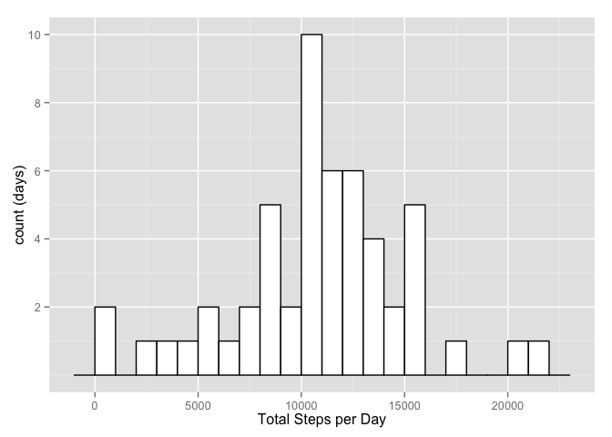
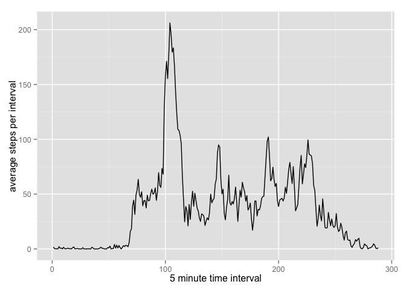
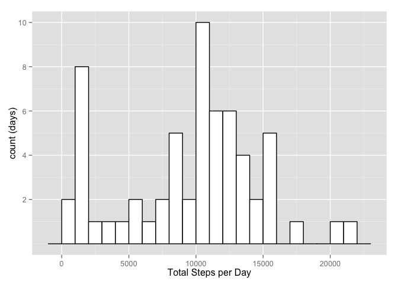
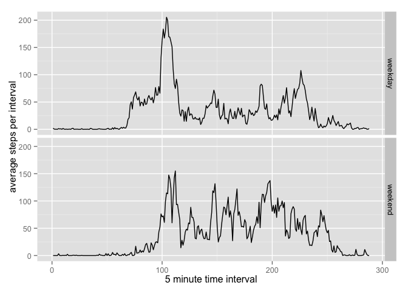

# Reproducible Research:


## Loading and preprocessing the data
Data has been provided for this assignment as a zip file in the forked 
directory.  The following code checks for the existance of the unzipped,
csv format file and only unzips if the file is not present.  


```r
require(dplyr)
```

```
## Loading required package: dplyr
## 
## Attaching package: 'dplyr'
## 
## The following object is masked from 'package:stats':
## 
##     filter
## 
## The following objects are masked from 'package:base':
## 
##     intersect, setdiff, setequal, union
```

```r
library(ggplot2)
```

Once the data is read, the date field, which originally is a character
variable is converted to Date type by nterpreting it as YYYY-MM-DD. 


```r
if (!file.exists("activity.csv")) {
    print("unzipping...")
    unzip("activity.zip")
}

activity <- read.csv(file="./activity.csv")
activity$date <- as.Date(activity$date, format='%Y-%m-%d')
activity_df <- tbl_df(activity)
activity_df$minint <- activity$interval %/% 100 * 60 + 
    activity$interval %% 100
activity_df$finterval <- as.factor(activity_df$minint)
```
## What is mean total number of steps taken per day?

For this part of the assignment we were instructed that we "can ignore the 
missing values". I understood this to mean that we did not need to perform 
special handling of missing values rather than remove ("ignore") those records.
Consequently, only default actions by the routines used for missing values will 
have been included.  
Okay, so talk about the grouping of the data...


```r
steps_by_day <- activity_df %>%
    group_by(date) %>%
    summarize(total = sum(steps))
```

more comments about the plot


```r
library(ggplot2)
ggplot(steps_by_day, aes(x=total)) +
    geom_histogram(binwidth=1000, colour="black", fill="white") +
    xlab("Total Steps per Day") + ylab("count (days)") +
    scale_y_continuous(breaks=c(2, 4, 6, 8, 10))
```

 

A quick look at the median and mean


```r
summary(steps_by_day$total)
```

```
##    Min. 1st Qu.  Median    Mean 3rd Qu.    Max.    NA's 
##      41    8841   10760   10770   13290   21190       8
```
## What is the average daily activity pattern?

Okay, so talk bout the grouping of the data, again...

This time we want to look at activity variation through the day averaging all 
dates together.


```r
#activity_df$finterval <- as.factor(activity_df$interval)

steps_by_interval <- activity_df %>%
    group_by(finterval) %>%
    summarize(intavg = mean(steps, na.rm=TRUE))
steps_by_interval$ival <- as.integer(steps_by_interval$finterval)

ggplot(steps_by_interval, aes(ival, intavg)) +
    geom_line()
```

 

The peak (or maximum interval) in the above graph is at:

```r
max(steps_by_interval$intavg)
```

```
## [1] 206.1698
```

```r
which.max(steps_by_interval$intavg)
```

```
## [1] 104
```

```r
hour <- which.max(steps_by_interval$intavg)%/%12
minute <- (which.max(steps_by_interval$intavg) %% 12) * 5
print(sprintf("%d:%d", hour, minute), quote=FALSE)
```

```
## [1] 8:40
```
## Imputing missing values

How many missing values do we have in the data?

```r
sum(is.na(activity_df$steps))
```

```
## [1] 2304
```

```r
sum(is.na(activity_df$steps))/nrow(activity_df)*100
```

```
## [1] 13.11475
```
This is a significant amount of the data - approximately 1 in 8 measurements is
an NA.


```r
medsteps <- activity_df %>%
    group_by(finterval) %>%
    summarize(intmed = median(steps, na.rm=TRUE))

activity_df2 <- activity_df

for (i in 1:nrow(activity_df2)) {
    if (is.na(activity_df2$steps[i])) {
        activity_df2$steps[i] <- medsteps$intmed[activity_df2$minint[i]/5+1]
    }
}

sum(is.na(activity_df2$steps))
```

```
## [1] 0
```


```r
steps_by_day2 <- activity_df2 %>%
    group_by(date) %>%
    summarize(total = sum(steps))

ggplot(steps_by_day2, aes(x=total)) +
    geom_histogram(binwidth=1000, colour="black", fill="white") +
    xlab("Total Steps per Day") + ylab("count (days)") +
    scale_y_continuous(breaks=c(2, 4, 6, 8, 10))
```

 


```r
summary(steps_by_day2$total)
```

```
##    Min. 1st Qu.  Median    Mean 3rd Qu.    Max. 
##      41    6778   10400    9504   12810   21190
```
## Are there differences in activity patterns between weekdays and weekends?


```r
activity_df2$day <- weekdays(activity_df2$date)
activity_df2$daytype <- "weekday"
activity_df2$daytype[activity_df2$day=="Saturday" | 
                         activity_df2$day=="Sunday"] <- "weekend"
activity_df2$daytype <- as.factor(activity_df2$daytype)

steps_by_weekday <- activity_df2 %>%
    group_by(daytype, finterval) %>%
    summarize(intavg = mean(steps, na.rm=TRUE))
steps_by_weekday$ival <- as.integer(steps_by_weekday$finterval)

ggplot(steps_by_weekday, aes(ival, intavg)) +
    geom_line() + facet_grid(daytype ~ .)
```

 
